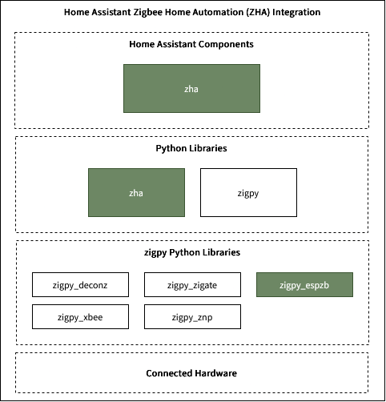

# ZHA Integration with ESP-Zigbee (ESP32-C6)

This repo includes patches and instructions for integrating ESP-Zigbee (ESP32-C6) as Zigbee Coordinator with Home Assistant's ZHA integration.


This repo provides patches for the green boxes in the ZHA stack diagram below:



* `zigpy_deconz`, `zigpy_zigate`, `zigpy_xbee`, `zigpy_znp` are other zigpy radio libraries. [More details](https://www.home-assistant.io/integrations/zha/)
* `zigpy_espzb` is the zigpy library for ESP-Zigbee (ESP32-C6) based coordinators that has been added to `zha` as a new radio library.
* The new radio is called "ZNSP = Espressif Zigbee NCP Serial Protocol (ESP ZNSP)" in the ZHA integration UI.

## Installation Steps with Home Assistant Docker

```
git clone --recurse-submodules <this-repo>
cd ZHA-ESP-Integration/deps
bash apply_patches.sh
```

> [!Note]
> Use the firware provided in [firmware](./firmware) directory.
> Source: https://github.com/lhespress/zigpy-espzb/pull/13

* mount a local volume for home assistant config: `-v /path/to/your/config:/config`
* add `custom_components` directory to `/path/to/your/config`. This will overwrite existing ZHA component on the Home Assistant instance.
* copy the deps directory to `/path/to/your/config/deps`.
* bash into the home assistant container to install new python libraries

```
docker exec -it <container_id> bash
cd /config/deps
pip install ./zha/.
pip install ./zigpy-espzb/.
```
* Restart the home assistant server. _Settings -> top right menu -> Restart Home Assistant_

## Collaboration

Feel free to open discussion/issue posts, and I will try to address them as soon as possible.